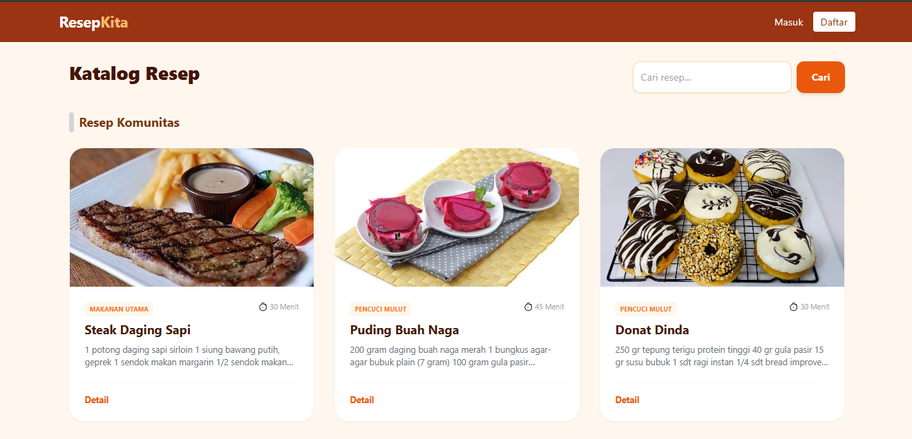
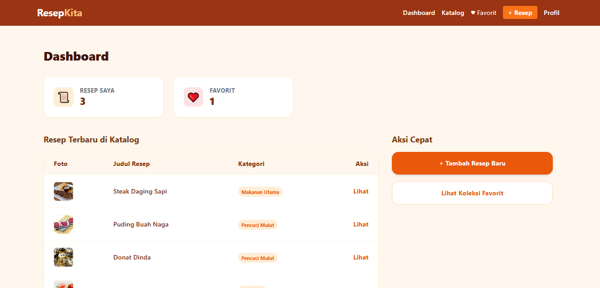
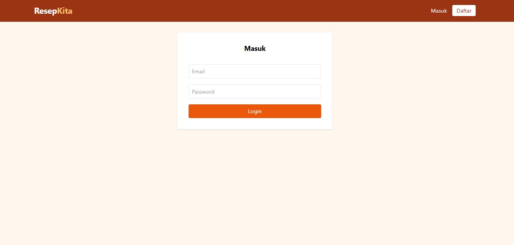
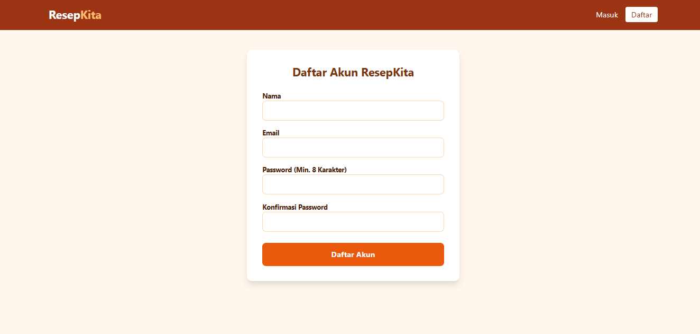
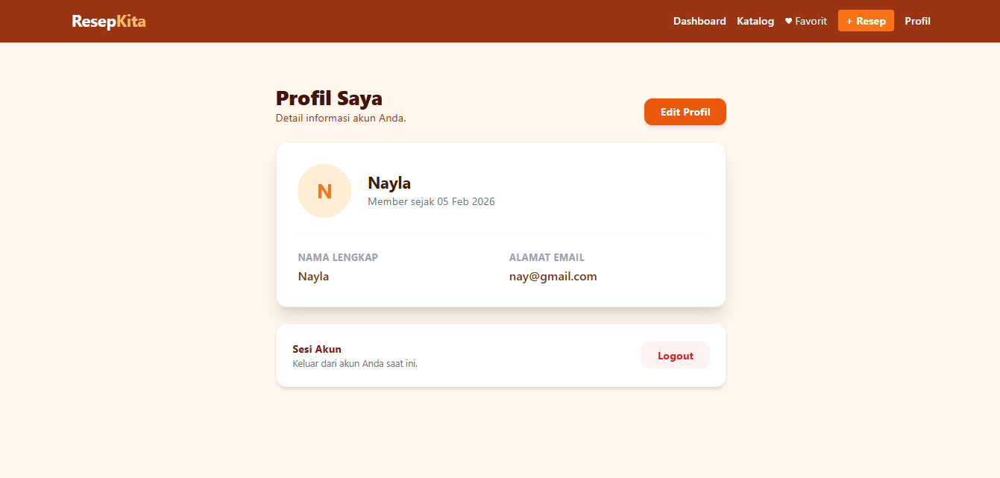
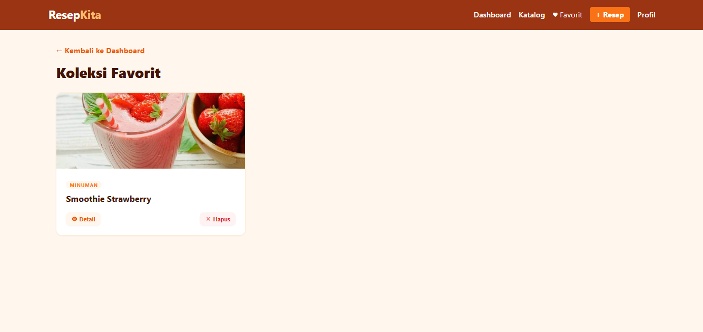
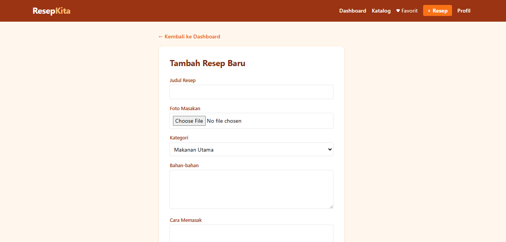
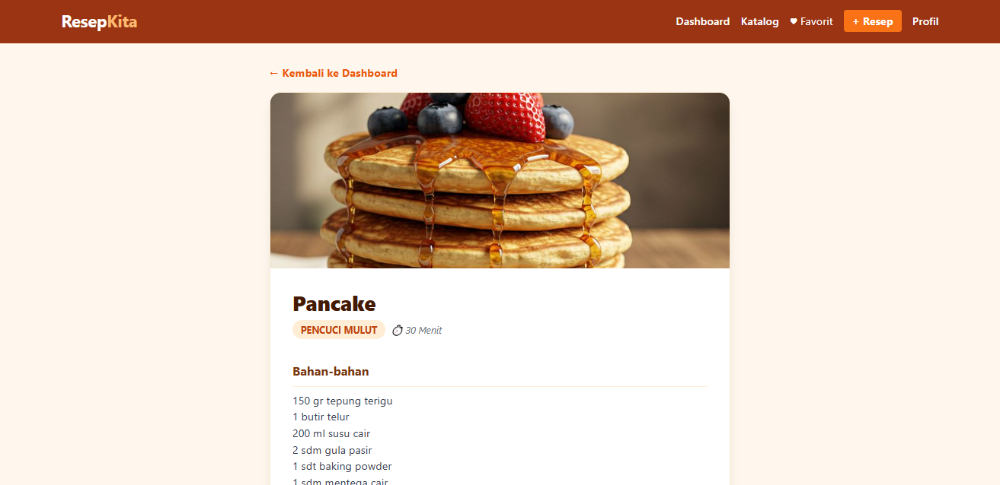
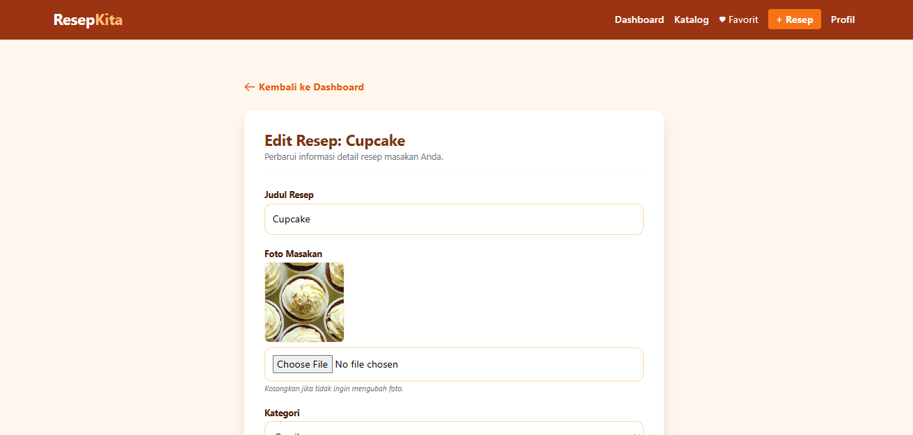

# ResepKita

## Nama Website
**ResepKita**

## Teknologi yang Digunakan
Sistem ini dibangun menggunakan teknologi berikut:
- **Framework Backend:** Laravel 12.0
- **Bahasa Pemrograman:** PHP 8.2
- **Database:** MySQL (via Laragon)
- **Frontend / Styling:** TailwindCSS (CDN)
- **Templating Engine:** Blade

## Deskripsi dan Tujuan Website
**ResepKita** adalah platform berbagi resep masakan yang dirancang untuk memudahkan pengguna dalam mencari, menyimpan, dan membagikan resep masakan favorit mereka.

Tujuan utama website ini dibuat adalah:
1.  Menyediakan wadah bagi penggemar kuliner untuk berbagi kreasi resep mereka.
2.  Memudahkan pengguna lain untuk menemukan inspirasi masakan sehari-hari.
3.  Mengimplementasikan fitur CRUD (Create, Read, Update, Delete) serta autentikasi pengguna sebagai pemenuhan tugas besar mata kuliah Praktikum Pemrograman Web.

## Nama Kelompok
**Kelompok 2**

## Anggota Kelompok
Berikut adalah daftar anggota kelompok yang berkontribusi dalam pembuatan proyek ini:

| No | Nama Lengkap | NIM |
|:--:|:---|:---|
| 1 | **Nayla Nur Faridah** | 2307026 |
| 2 | **Dinda Aulia Putri** | 2307009 |
| 3 | **Ardi Nur Harom** | 2307025 |

## Database MySQL
https://drive.google.com/drive/folders/1KFow2_SSG1sx2gMxYPwf-7wdESfiDVOT

## Galeri Aplikasi

Berikut adalah tangkapan layar dari tampilan aplikasi kami:

### 1. Landing Page

### 2. Dashboard User

### 3. Halaman Login

### 4. Halaman Register

### 5. Halaman Profile

### 6. Halaman Favorit

### 7. Fitur CRUD
**Tampilan Form Tambah Resep**

**Tampilan Detail Resep**

**Tampilan Edit Resep**

**Tampilan Katalog**

